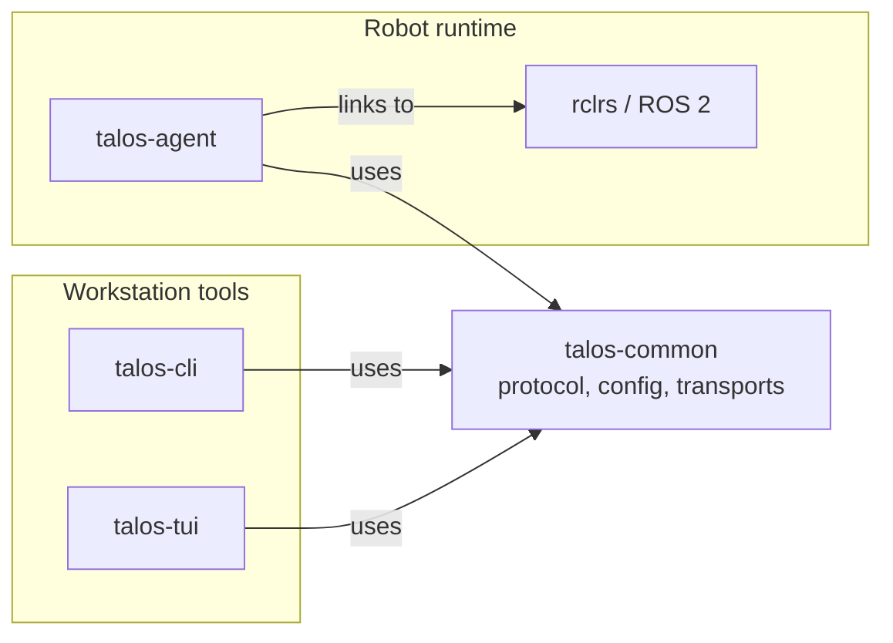

# Architecture Overview

Talos has a strict dependency boundary around ROS 2:

`talos-common` is the shared base. It defines the protocol types, bincode
framing, client session trait, transport setup, configuration model, and URDF
parsing. It has no ROS 2 dependency.

`talos-agent` is the only crate that links to ROS 2. It creates the ROS 2 node,
subscribes to configured topics, converts ROS 2 messages into `DynValue`, and
serves Talos clients.

`talos-cli` and `talos-tui` are workstation tools. They only need the Talos
protocol and a reachable agent.

## Data Flow

1. The agent starts and loads configuration.
2. The ROS 2 bridge subscribes to configured topics.
3. Each ROS 2 message is converted to a transport-neutral `DynValue`.
4. Client tools connect to the agent and explicitly subscribe to topics.
5. The router forwards topic data only to clients subscribed to that topic.

## Important Boundaries

The agent owns ROS 2 message typing and conversion. Clients receive generic
Talos protocol data and do not need ROS 2 message definitions.

The protocol layer hides transport differences from the CLI and TUI. UDS uses a
single framed connection. QUIC uses a bidirectional control stream plus
server-initiated unidirectional data streams.

The terminal UI is a client of the protocol, not a special case inside the
agent. It reconnects, lists topics, subscribes, and renders the latest data it
has received.
